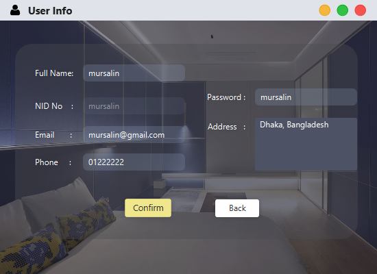
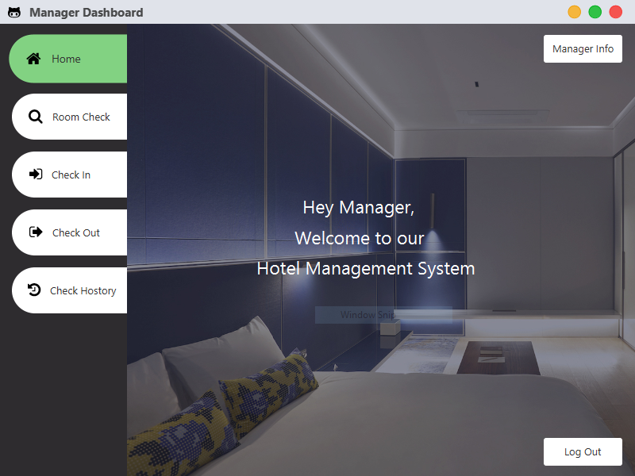
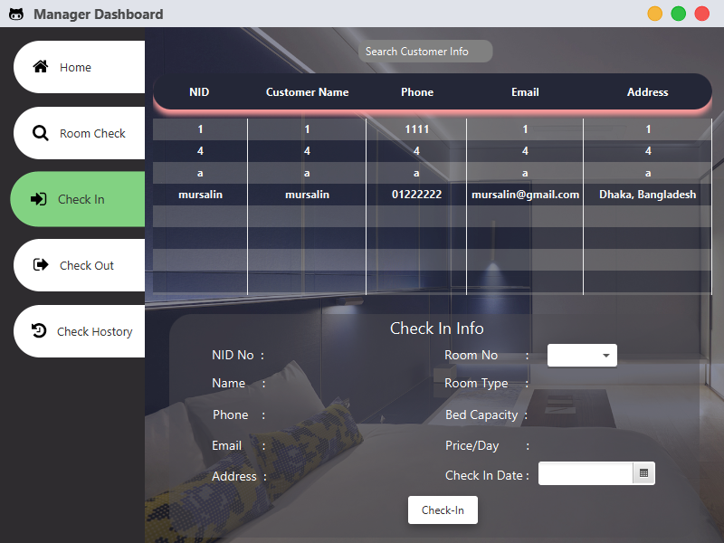
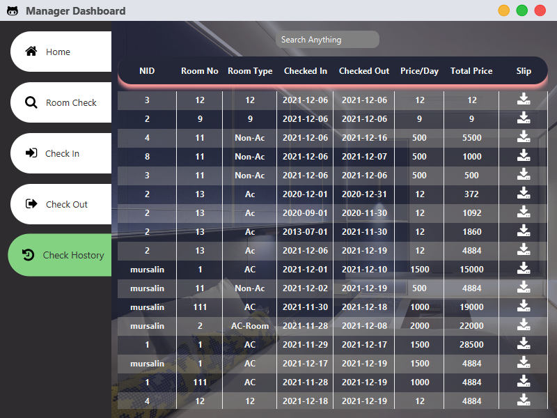
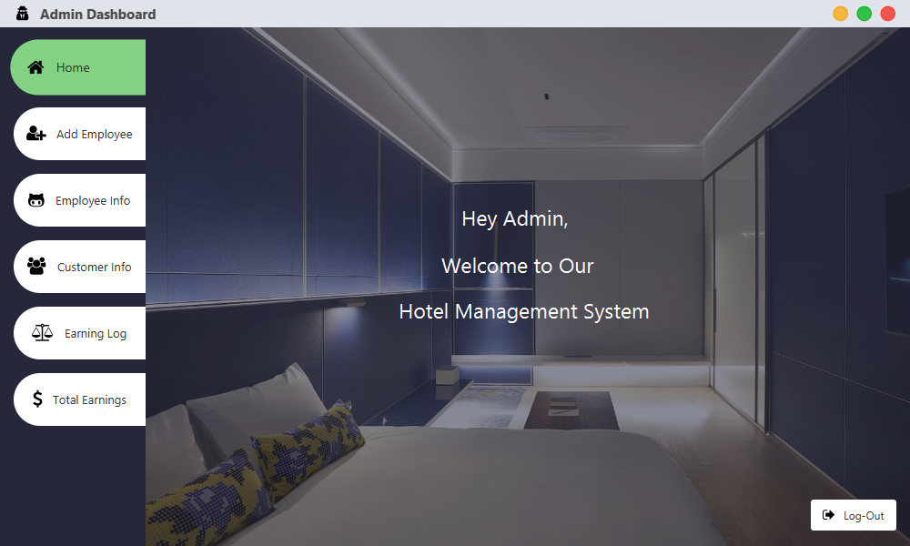
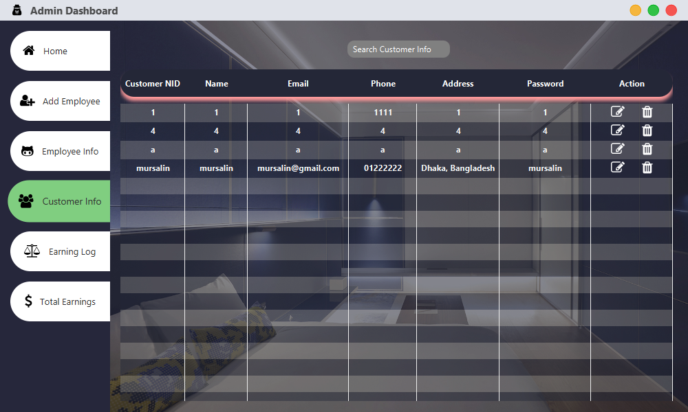

# `Hotel Management System With JavaFX`
 
## Introduction:  
Hotel management System is a desktop application where users
can book hotel room, review about the hotel service. Managers
can manage rooms, book rooms for new customers. And the admin of this application can create,
update and delete employees for their application and can also
see the total earnings from their hotel.

In this way, the hotel management will be easier to handle
with this application than they used to keep track of all details
manually in their ledger. The customers, managers and the
employees can be more happy with this new system.

# `Screenshots:`

`Customer`

Customer Login  
  
Customer Sign-Up 
  
Customer UserInfo 
  
Customer UserInfo Edit 
  
Customer Home 
  
Customer Manage Room 
  
Customer Check In 
  
Customer Check History 
  

`Manager`

Manager Home  
  
Manager Manage Room  
  
Manager Check In  
  
Manager Check Out  

Manager Check History  
  

`Admin`

Admin Home  
  
Admin Add Employee  
  
Admin Employee Info  
  
Admin Customer Info  
  
Admin Earning Log  
  

## All Download Links:
  
Jar Download Link: <a href = "https://github.com/Rakib-Hasan-455/Hotel_Management_System-JavaFx/raw/master/Hotel_Management_System_JavaFx.jar"> Download </a> 
Exe File Download Link: <a href = "https://github.com/Rakib-Hasan-455/Hotel_Management_System-JavaFx/raw/master/Hotel_Management_System.exe"> Download </a> 
MySql Database Download Link:  <a href = "https://downgit.github.io/#/home?url=https://github.com/Rakib-Hasan-455/Hotel_Management_System-JavaFx/blob/master/Hotel_Management_System.sql"> Download </a> 
Java Version 8 Download Link: <a href = "https://www.oracle.com/java/technologies/javase/javase8u211-later-archive-downloads.html"> Download </a> 
 

## Used Library Files:  

JFoenix 8.0.10: <a href = "https://github.com/Rakib-Hasan-455/Hotel_Management_System-JavaFx/raw/master/lib/jfoenix-8.0.10.jar"> Download </a> 
MySql JDBC Connector 8.0.26:  <a href = "https://github.com/Rakib-Hasan-455/Hotel_Management_System-JavaFx/raw/master/lib/mysql-connector-java-8.0.26.jar"> Download </a> 
FontAwesomeFX 8.9:  <a href = "https://github.com/Rakib-Hasan-455/Hotel_Management_System-JavaFx/raw/master/lib/fontawesomefx-8.9.jar"> Download </a> 

## Requirements to Run Jar/Exe file: 
<li>Install MySql and it should be running on <b>localhost:3306</b>  .</li>
<li>Download Hotel Management System Database and Install it into your MySql Database.</li>
<li> Your Java Version Must be 8 or above.</li>

## Contributing
Pull requests are welcome. For major changes, please open an issue first to discuss what you would like to change.
Please make sure to update tests as appropriate.

## License
Distributed under the MIT License. See [License](LICENSE) for more information.
