# `Hotel Management System With JavaFX` 

## Introduction:

Hotel management System is a desktop application where users
can book hotel room, review about the hotel service. Managers
can manage rooms, book rooms for new customers. And the admin of this application can create,
update and delete employees for their application and can also
see the total earnings from their hotel.

In this way, the hotel management will be easier to handle
with this application than they used to keep track of all details
manually in their ledger. The customers, managers and the
employees can be more happy with this new system.

## Watch Overview Video

[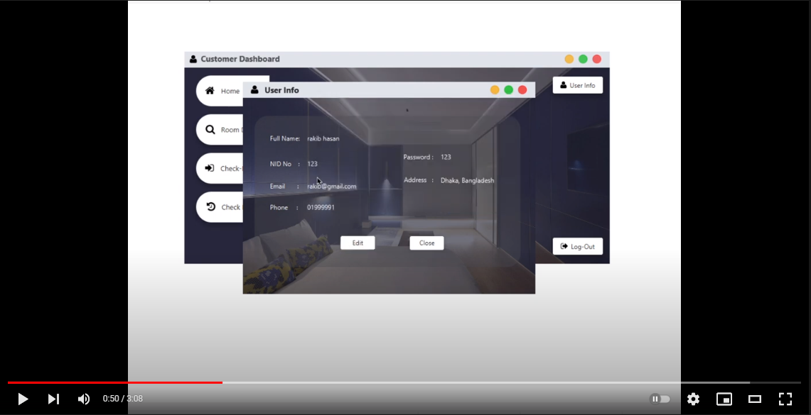](https://www.youtube.com/watch?v=_UOMsHpJSeg)

## Screenshots:

## `Home Window`

Main Window  
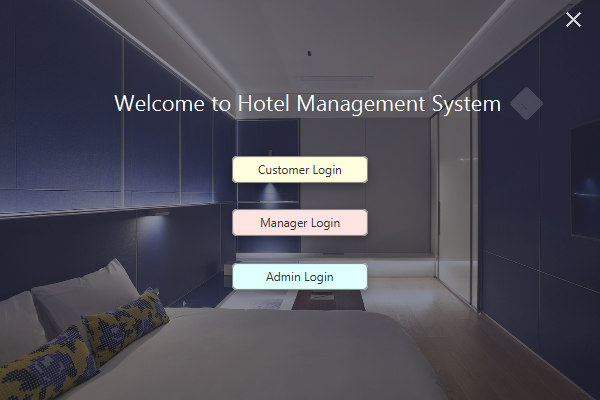
## `Customer`

Customer Login  
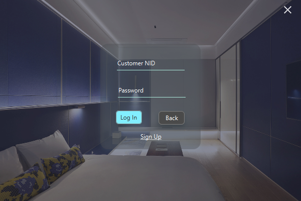  
Customer Sign-Up 
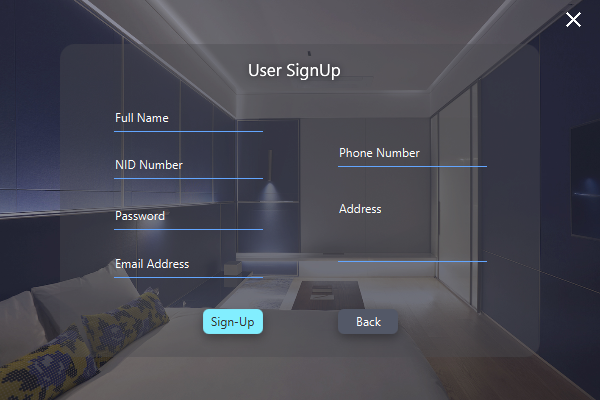  
Customer UserInfo 
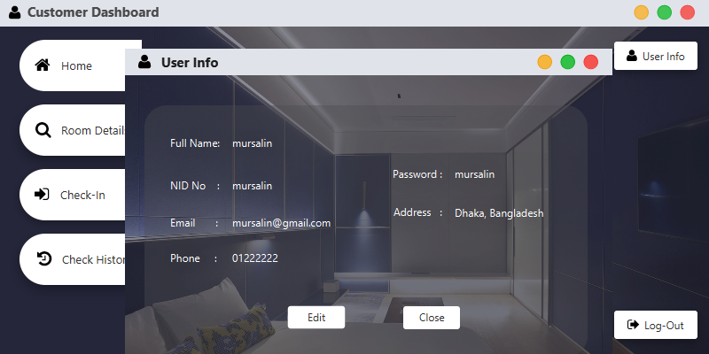  

[comment]: <> (Customer UserInfo Edit )
[comment]: <> (![UserInfo Edit]&#40;screenshots/Customer0000.PNG "UserInfo Edit"&#41;  )
Customer Home 
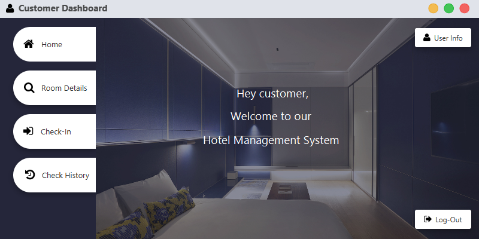  
Customer Manage Room 
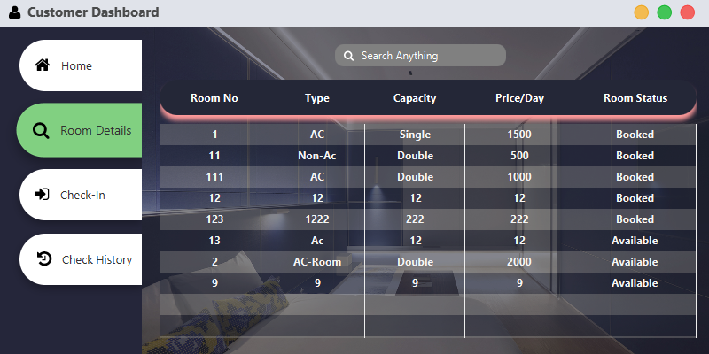  
Customer Check In 
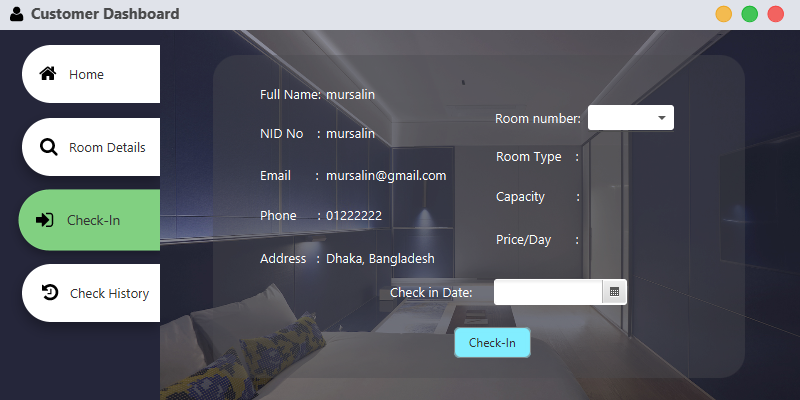  
Customer Check History 
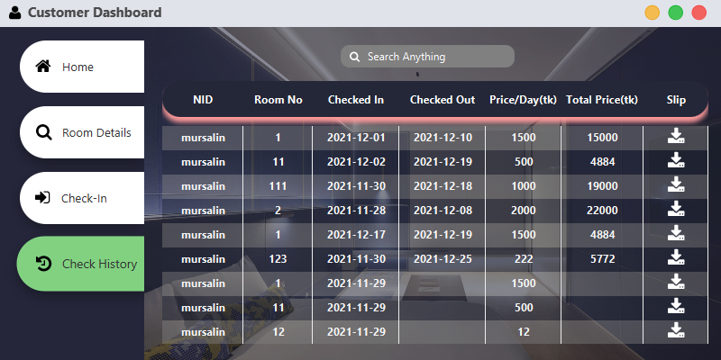  

## `Manager`

[comment]: <> (Manager Home  )
[comment]: <> (![Manager Home]&#40;screenshots/Manager0.PNG "Manager Home"&#41;  )
Manager Manage Room  
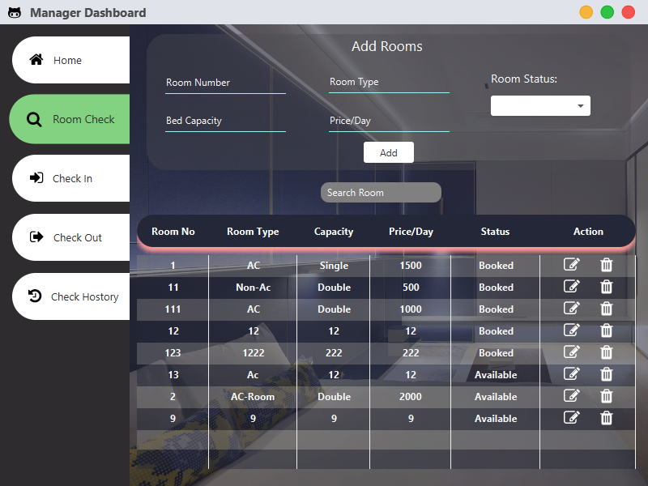  

[comment]: <> (Manager Check In  )

[comment]: <> (![Check In]&#40;screenshots/Manager2.PNG "Manager Check In"&#41;  )
Manager Check Out  
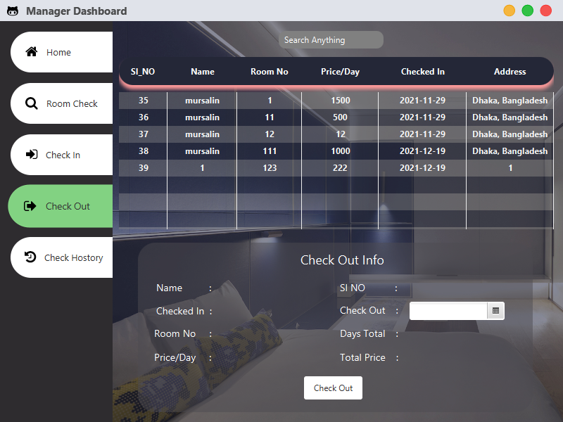  

[comment]: <> (Manager Check History  )

[comment]: <> (![Check History]&#40;screenshots/Manager4.PNG "Manager Check History"&#41;  )

## `Admin`

[comment]: <> (Admin Home  )

[comment]: <> (![Admin Home]&#40;screenshots/Admin0.PNG "Admin Home"&#41;  )
Admin Add Employee  
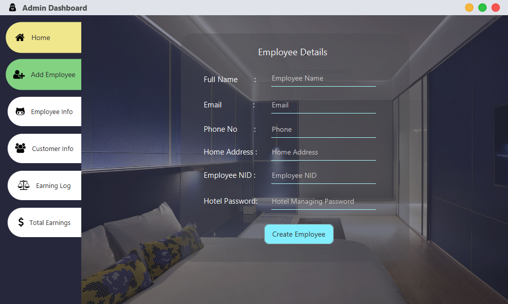  
Admin Employee Info  
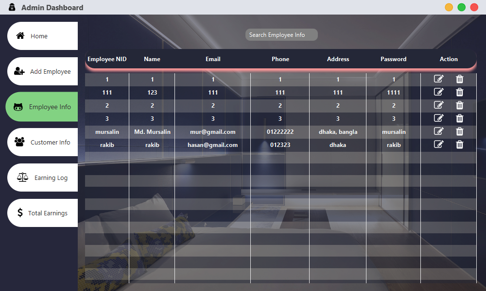  

[comment]: <> (Admin Customer Info  )

[comment]: <> (![Admin Customer Info]&#40;screenshots/Admin3.PNG "Admin Customer Info"&#41;  )
Admin Earning Log  
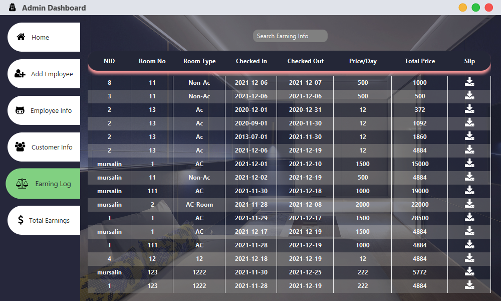  

  

## All Download Links:

Jar Download Link: <a href = "https://github.com/Rakib-Hasan-455/Hotel_Management_System-JavaFx/raw/master/Hotel_Management_System%20JavaFx.jar"> Download </a> 
Exe File Download Link: <a href = "https://github.com/Rakib-Hasan-455/Hotel_Management_System-JavaFx/raw/master/Hotel_Management_System.exe"> Download </a> 
Hotel Management System Database Download Link:  <a href = "https://downgit.github.io/#/home?url=https://github.com/Rakib-Hasan-455/Hotel_Management_System-JavaFx/blob/master/Hotel_Management_System.sql"> Download </a> 
Java Version 8 Download Link: <a href = "https://www.oracle.com/java/technologies/javase/javase8u211-later-archive-downloads.html"> Download </a> 
 

## Used Library Files:

JFoenix 8.0.10: <a href = "https://github.com/Rakib-Hasan-455/Hotel_Management_System-JavaFx/raw/master/lib/jfoenix-8.0.10.jar"> Download </a> 
MySql JDBC Connector 8.0.26:  <a href = "https://github.com/Rakib-Hasan-455/Hotel_Management_System-JavaFx/raw/master/lib/mysql-connector-java-8.0.26.jar"> Download </a> 
FontAwesomeFX 8.9:  <a href = "https://github.com/Rakib-Hasan-455/Hotel_Management_System-JavaFx/raw/master/lib/fontawesomefx-8.9.jar"> Download </a> 
itextpdf-5.3.4:  <a href = "https://github.com/Rakib-Hasan-455/Hotel_Management_System-JavaFx/raw/master/lib/itextpdf-5.3.4.jar"> Download </a> 

## Requirements to Run this project/Jar/Exe file:
<li>Install MySql and it should be running on <b>localhost:3306</b>  .</li>
<li><a href = "https://downgit.github.io/#/home?url=https://github.com/Rakib-Hasan-455/Hotel_Management_System-JavaFx/blob/master/Hotel_Management_System.sql"> Download </a> 
 Hotel Management System Database and Install it into your MySql Database.</li>
<li> Your Java Version Must be 8 or above.</li>
<li> Make Sure to edit 'sample/_backend/DBConnection.java' class. Where you need to edit database name, your database username and password which should be according to your own MySql database setup.</li>

## Default UserNid and Password

`Customer:` 
UserNid     : 4  
userPassword: 4  

`Manager`  
UserNid     : 2  
userPassword: 2  

`admin`  
UserNid     : admin  
userPassword: admin  

## Things and Tools I Used in this project:
<li> IntellIJ IDE </li>
<li> SceneBuilder 8.5 (for JFoenix 8.0.10 & java 8 compatible) </li>
<li> Java 8 </li>
<li> JavaFX </li>
<li> MySql </li>
<li> MySql JDBC Connector </li>
<li> JFoenix UI Components 8.0.10 </li>
<li> FontAwesome Font Components </li>

## Contributing
Pull requests are welcome. For major changes, please open an issue first to discuss what you would like to change.
Please make sure to update tests as appropriate.

## License
Distributed under the MIT License. See [License](LICENSE) for more information.
